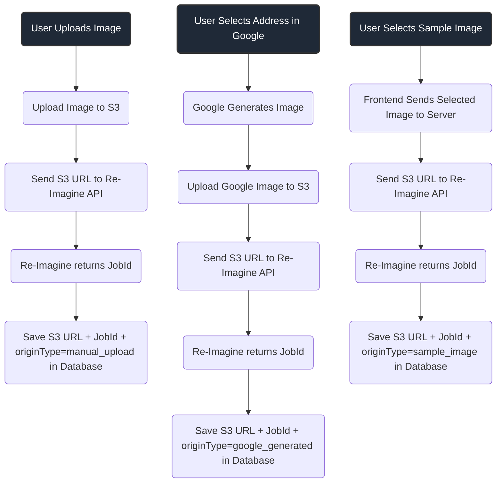

```mermaid
flowchart TD

  A1(User Uploads Image) --> B1(Upload Image to S3)
  B1 --> C1(Send S3 URL to Re-Imagine API)
  C1 --> D1(Re-Imagine returns JobId)
  D1 --> E1(Save S3 URL + JobId + originType=manual_upload in Database)

  A2(User Selects Address in Google) --> B2(Google Generates Image)
  B2 --> C2(Upload Google Image to S3)
  C2 --> D2(Send S3 URL to Re-Imagine API)
  D2 --> E2(Re-Imagine returns JobId)
  E2 --> F2(Save S3 URL + JobId + originType=google_generated in Database)

  A3(User Selects Sample Image) --> B3(Frontend Sends Selected Image to Server)
  B3 --> C3(Send S3 URL to Re-Imagine API)
  C3 --> D3(Re-Imagine returns JobId)
  D3 --> E3(Save S3 URL + JobId + originType=sample_image in Database)

  style A1 fill:#1f2937,stroke:#333,stroke-width:2px,color:#fff
  style A2 fill:#1f2937,stroke:#333,stroke-width:2px,color:#fff
  style A3 fill:#1f2937,stroke:#333,stroke-width:2px,color:#fff

```
